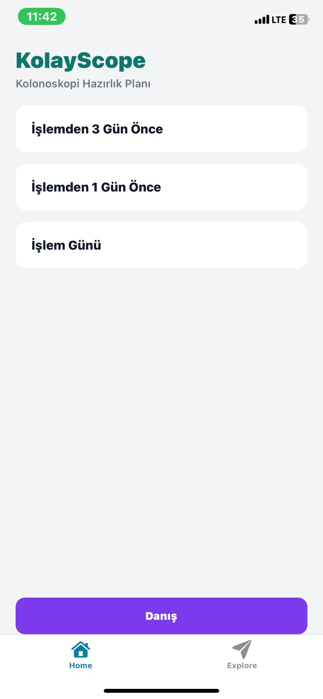
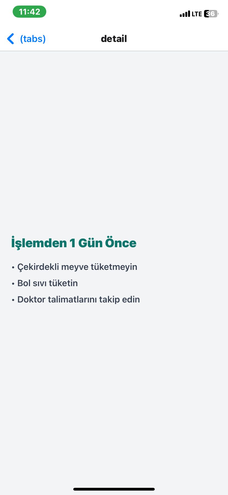
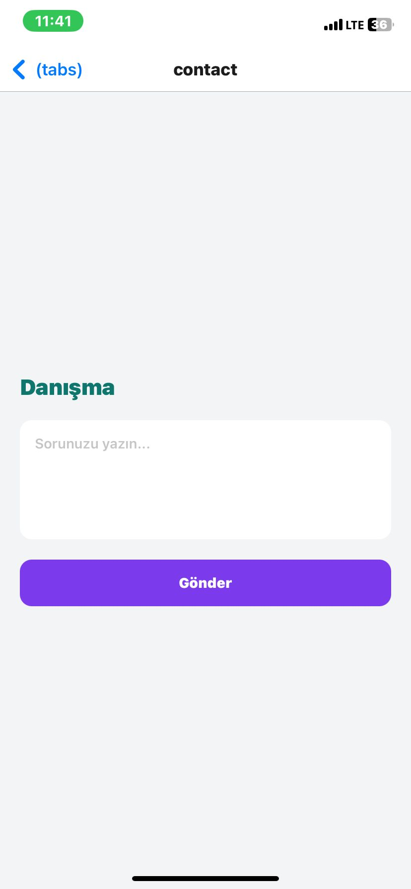

# KolayScope

Kolonoskopi öncesi bağırsak hazırlık sürecini adım adım yöneten mobil uygulama.

## 🎯 Amaç
Hastaların işlem öncesi hazırlık sürecini kolay ve anlaşılır şekilde takip edebilmesini sağlamak.

## 🚀 Özellikler
- Hazırlık planı liste ekranı
- Gün bazlı detay ekranı
- Danışma formu
- Basit navigasyon yapısı

## 🛠 Kullanılan Teknolojiler
- React Native
- Expo Router
- TypeScript

## ▶️ Çalıştırma

```bash
npm install
npx expo start
```


## 📸 Uygulama Görselleri

### Ana Ekran


### Detay Ekranı


### Danışma Ekranı
